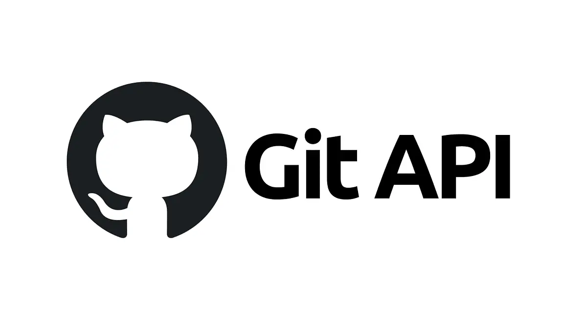

[](https://choosealicense.com/licenses/mit/)


# 📊 Pipeline de données GitHub & API REST 

Projet réalisé en autonomie dans un contexte pédagogique simulant une mission réelle en entreprise. L'objectif est de construire un pipeline complet de traitement de données publiques issues de GitHub, et de les exposer via une API sécurisée et documentée avec **FastAPI**.

---

## 🎯 Objectifs pédagogiques

- 🔄 Automatiser l’extraction de données via l’API GitHub.
- 🧹 Nettoyer, structurer et filtrer des données JSON.
- 🌐 Exposer ces données via une API REST sécurisée (authentification par token).
- 🧪 Écrire des tests automatisés pour valider les comportements attendus.

---

## 🏢 Contexte pédagogique

Vous travaillez dans une équipe chargée d'alimenter une plateforme interne avec des données fiables d'utilisateurs GitHub. Ces données doivent être rendues accessibles aux développeurs de l’entreprise via une API REST.

Vous devez donc construire un **pipeline complet de traitement de données** :

1. **Extraction automatique** de données depuis l’API publique GitHub.
2. **Filtrage** des données pour ne conserver que les champs pertinents.
3. **Exposition** des données filtrées via une API REST sécurisée.
4. **Test** des routes de l’API pour garantir sa fiabilité.

Ce projet simule une situation professionnelle où le code doit être **fonctionnel**, **maintenable**, **sécurisé** et **documenté**.

---

## 🛠️ Technologies utilisées

- **Python 3.10**
- **FastAPI** – création de l’API REST
- **Uvicorn** – serveur ASGI pour le développement
- **Requests** – pour appeler l’API GitHub
- **Python-dotenv** – gestion des variables sensibles
- **Pytest** – tests unitaires

---

## 🗂️ Structure du projet
```bash
API_REST_GitHub/
├── extract_users.py # Script d'extraction des utilisateurs GitHub
├── filtered_users.py # Nettoyage et filtrage des données extraites
├── data/
│     ├── users.json # Données brutes (non filtrées)
│     └── filtered_users.json # Données filtrées (prêtes à servir)
│
├── api/
│    ├── main.py # Point d'entrée de l'API FastAPI
│    ├── models.py # Schémas Pydantic
│    ├── routes.py # Définition des endpoints
│    └── security.py # Système de token et authentification
│
├── tests/
│     └── test_api.py # Suite de tests Pytest
│
├── requirements.txt # Liste des dépendances
├── .env # Contient le token GitHub et credentials API
│
├── document_README/ # Contient des documents qui explique le projet
│            ├─────── code.md # Document qui explique le code du projet
│            ├─────── test.md # Document qui explique les tests
│            └─────── postman.md # Document qui explique postman
│ 
├── images/ # Dossier qui contient des images pour le README
│ 
├── postman/ # Dossier qui contient les configuration de postman
│ 
└── README.md # Documentation du projet
```

## ⚙️ Installation
>[!WARNING]
>Assurez-vous d'avoir *Python 3.10*

1. **Cloner le dépôt**
```bash
git clone https://github.com/aruide/API_REST_GitHub.git
cd API_REST_GitHub
```

2. **Créer un environnement virtuel**
```bash
python -m venv .venv
source .venv/bin/activate  # ou .venv\Scripts\activate sous Windows
```

3. **Installer les dépendances**
```bash
python -m pip install -r requirements.txt
```
>🔎 L’utilisation de **python -m** pip garantit que le bon interpréteur Python (celui de l’environnement virtuel) est utilisé, ce qui évite les conflits avec des paquets globaux.

## 🚀 Lancer les pipelines
>[!WARNING]
>Assurez-vous d'avoir mis votre token GitHub dans votre **.env** (changer le nom de **.env.example** en **.env**)

```ini
GITHUB_TOKEN= XXXXXXXXXXX #mettre votre token

ADMIN=admin123
PASSWD=password
SECRET_KEY=un_secret_tres_long_et_complexe
ALGORITHM = HS256
ACCESS_TOKEN_EXPIRE_MINUTES = 30
```

1. **Extraire les utilisateurs GitHub**
```bash
python extract_users.py #extrait 30 utilisateurs
```
**ou**
```bash
python extract_users.py --max-users 120 #extrait 120 utilisateurs (on peut changer le nombre par celui qu'on veut)
```

2. **Filtrer les utilisateurs**
```bash
python filtered_users.py
```
>filtre selon plusieur critéres:
>* Le champ bio est renseigné (ni vide, ni null)
>* Le champ avatar_url est valide (pas vide)
>* Le champ created_at est postérieur au 1er janvier 2015

## 🔐 Lancer l’API FastAPI

```bash
uvicorn api.main:app --reload
```

## 📝 Explications
* 🛠️ [Extraction et Filtrage des Données GitHub](document_README/filtrage.md) – Scripts pour collecter et nettoyer les utilisateurs depuis l’API GitHub.

* 📦 [Code de base](document_README/code.md) – Structure de l’API, modèles, routes, sécurité, etc.

* 🧪 [Tests automatisés (Pytest)](document_README/test.md) – Écriture, exécution et logique des tests.

* 📬 [Utilisation avec Postman](document_README/postman.md) – Importation et exécution des requêtes via Postman.

## 👤 Auteur
[ @aruide ](https://github.com/aruide)

## 📄 Licence

Ce projet est sous licence MIT. Voir le fichier LICENSE pour plus d'informations.
