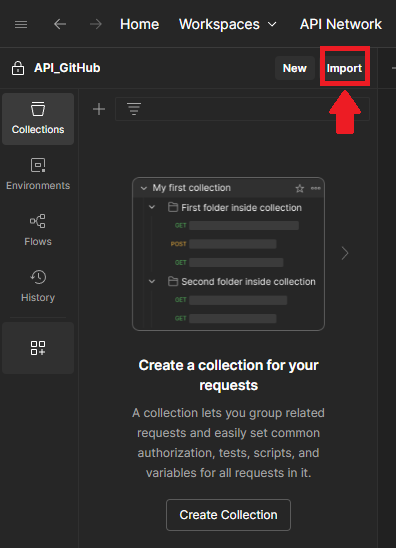
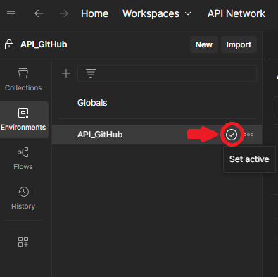
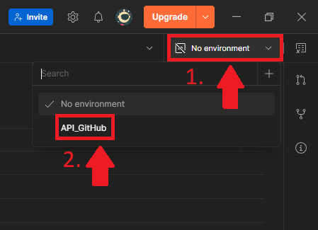
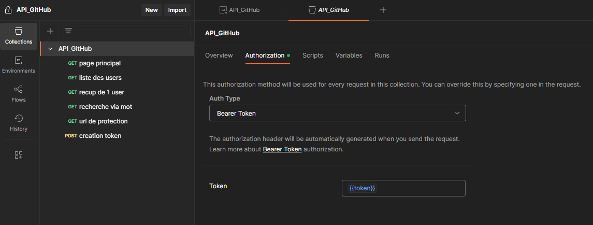
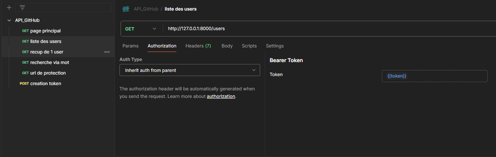

# 📬 Utilisation avec Postman

Ce guide explique comment utiliser [Postman](https://www.postman.com/) pour interagir avec l’API FastAPI de ce projet : authentification, accès aux routes, tests manuels.

## 🧾 Qu’est-ce que Postman ?
Postman est un outil populaire pour tester et interagir avec des APIs REST. Il permet :

* d’envoyer facilement des requêtes HTTP (GET, POST, etc.),
* d’ajouter des en-têtes (comme un token d’authentification),
* de sauvegarder des collections de requêtes,
* d'automatiser des tests et scénarios.

## 📁 Importer les fichiers Postman

1. Ouvrir Postman
    * Assure-vous d’avoir installé Postman (via [postman.com/downloads](https://www.postman.com/downloads/)).

2. Importer la collection
    * Lance Postman.
    * Clique sur "Import" en haut à gauche.
    
    * glisser/deposer les fichiers `API_GitHub.postman_collection.json` et `API_GitHub.postman_collection.json` qui se trouve dans le dossier `postman` 
    * Clique sur **Import**.

>[!WARNING]
>Ne pas oublier d'activer l'environnement:

### méthode 1:



### méthode 2:



## ⚙️ Configuration de l’environnement

L’environnement contient des variables utiles comme :

|Nom de variable|Description|
|---|---|
|`user`|la variable utilisateur qui se trouve dans le `.env` (`ADMIN`)|
|`passwd`| la variable mot de passe qui se trouve dans le `.env` (`PASSWD`)|
|`token`|Token JWT d'authentification (obtenu avec la requete `POST /token`)|

## 🔐 Générer un token JWT

1. Allez dans la requête POST /token.
2. Dans l’onglet "Body", remplis :
    * username = celui défini dans .env (ADMIN)
    * password = celui défini dans .env (PASSWD)
3. Clique sur "Send".
4. Copie le champ `access_token` retourné.
5. Allez dans l’environnement (`API_GitHub`) et colle le token dans la variable token.

## 🚀 Utilisation des routes protégées
Pour les requêtes nécessitant un token :

* Toutes les routes sauf `/` et `/token` nécessitent l’en-tête :

```http
Authorization: Bearer <token>
```

* Dans la collection Postman, cela est déjà configuré :

    * via le dossier principal:

    

    * ou via les requetes (qui herite de l'authorisation du parent): 

    


l’en-tête Authorization utilise automatiquement la variable `{{token}}`.

## 📚 Exemple de routes à tester

* `GET /` → page d’accueil (publique)

* `POST /token` → authentification

* `GET /users/` → liste des utilisateurs

* `GET /users/{login}` → détail utilisateur

* `GET /users/search?q=...` → recherche

* `GET /protected` → test d’une route protégée

[⬅️ Retour au README principal](../README.md)